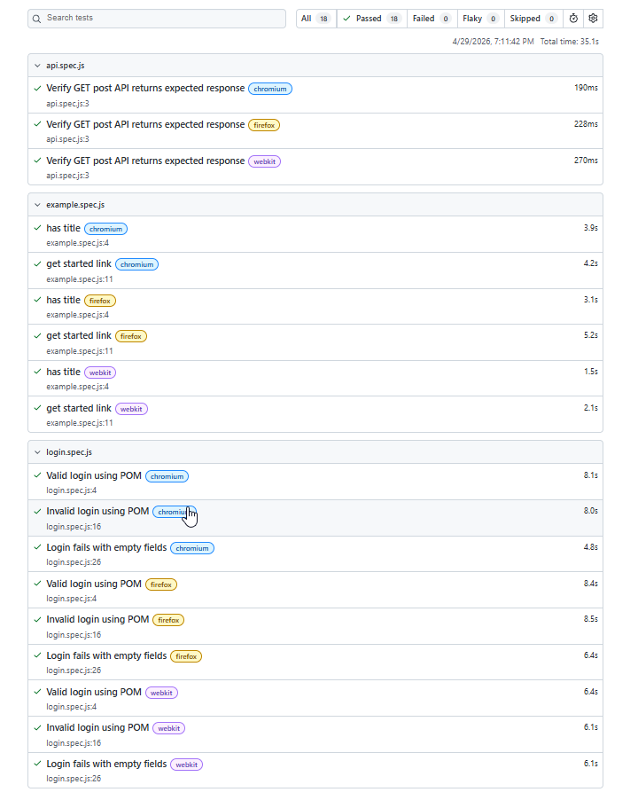

# Playwright QA Automation Framework

This is a QA automation practice project built using Playwright and JavaScript.  
The project includes UI automation, Page Object Model structure, and API testing.

## Tech Stack

- Playwright
- JavaScript
- Node.js
- GitHub
- API Testing

## Features Covered

- Valid login test
- Invalid login test
- Page Object Model implementation
- API GET request validation
- Basic assertions

## Project Structure

```text
QA-Playwright/
├── tests/
│   ├── login.spec.js
│   └── api.spec.js
├── pages/
│   └── LoginPage.js
├── docs/
│   └── login-test-cases.md
└── README.md
## Test Report

